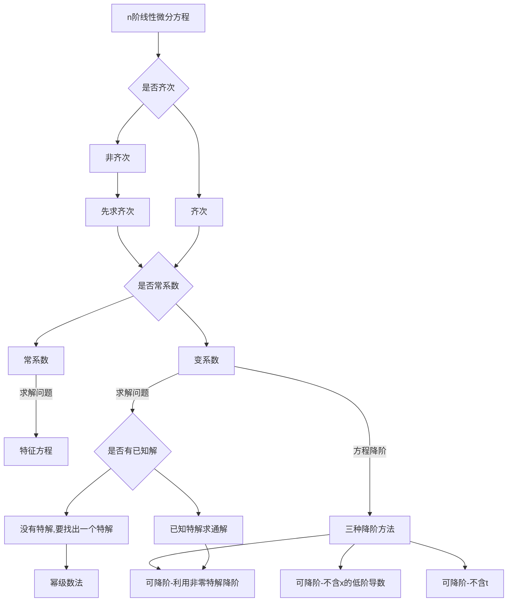

整理一下第四章n阶线性微分方程的各种流程

<!--more-->

```mermaid
graph TB
	A[n阶线性微分方程]
	I1{是否齐次}
	B1[齐次]
	B2[非齐次]
	I2{是否常系数}
	C1[常系数]
	C2[变系数]
	D[先求齐次]
	E[特征方程]
	I3{是否有已知解}
	H1[没有特解,要找出一个特解]
	H2[已知特解求通解]
	F[幂级数法]
	G1[可降阶-不含x的低阶导数]
	G2[可降阶-不含t]
	G3[可降阶-利用非零特解降阶]
	A-->I1
	I1-->B1
	I1-->B2-->D-->I2
	B1-->I2
	I2-->C1--求解问题-->E
	I2-->C2--求解问题-->I3
	C2--方程降阶-->G[三种降阶方法]
	G-->G1
	G-->G2
	G-->G3
    I3-->H1-->F
	I3-->H2-->G3
```

